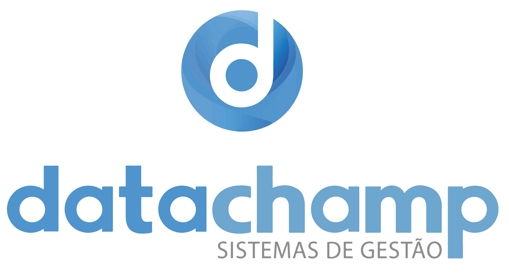
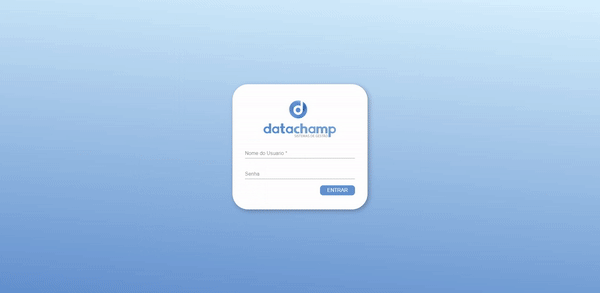
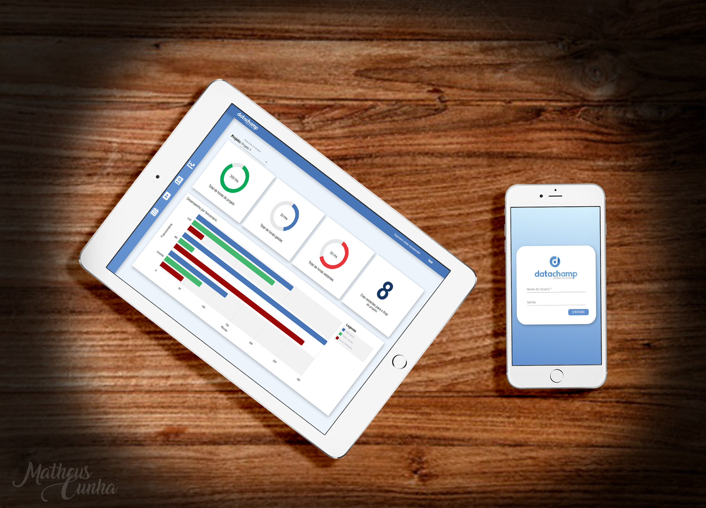

</a>

# Tracking System.

> Projeto desenvolvido com intúito de registrar horas de projetos informátizados.

> Este projeto foi criado utilizando uma versão do Angular Cli (https://github.com/angular/angular-cli) versão 7.3.5 e mockApi(www.mockapi.io) para interpretar os endpoints.

   

---
<div style="width: 100%;">



</div>
---

## Servidor de testes.

Para execução do projeto será necessário a instalação dos pacotes do cliente Angular, siga o passo a passo a seguir:

> Instale via terminal os arquivos necessarios para compilação do projeto. Em seguida execute o comando para iniciar o servidor de testes:
```shell
$ npm install
$ ng serve
```

Utilizando o servidor de testes, todas as modificações do codigo serão interpretadas pelo navegador e atualizaram automaticamente.

---

## Logotipia e marca.

Este projeto tem cunho didático e conteúdo fictício, que tem como premissa apenas apresentar de forma clara a distribuição de informações e estruturas comummente utilizadas em rotinas de desenvolvimento.

A logotipia utilizada neste projeto é de uma empresa já existente não desenvolvido por mim. Porém decidi utilizar o mesmo devido as cores e estrutura do mesmo.

---

## Status do projeto

- [x] Desenvolvimento de projeto.
- [x] Projeto base.
- [ ] Responsividade.
- [ ] Testes e implementações.

---

## Contribua

Este projeto possui codigo aberto para casos de opiniões, dicas ou apenas estudo de pessoas que buscam conhecimento (como eu).

### Passo 1

- Faça um Fork ou Clone este repositório.

### Passo 2

- Desenvolva, altere e trabalhe da forma que preferir.

### Passo 3

- Crie um novo pull request e aguarde a análise.

Por menor que seja o pull request, agradeço desde já sua contribuição. Todo o conhecimento é bem vindo!

---

## Contato

Me siga nas redes sociais! 

[Website](https://matheus-cunha.github.io/)

[Pinterest](https://br.pinterest.com/portifoliomatheuscunha/)

[Email](matheus.cunha.sjc@gmail.com)
